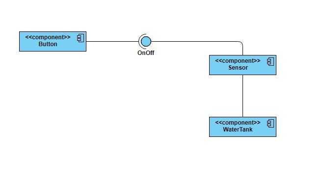

# WaterSensor
## Anggota :
1. M. Ade Ryan 1808107010051
2. Lia Asmaliza nim
3. Aisyah M. nim

## Deskripsi
Water sensor merupakan alarm untuk level ketinggian permukaan air pada bak penampungan secara otomatis. 
Pada water sensor menggunakan dua fitur yaitu  nyalakan air jika penampungan air kosong dan matikan air jika tempat penampungan air sudah penuh.  Cara kerja pada water sensor ini, apabila bak penampung air dalam keadaan kosong maka sensor akan mendeteksi ketinggian air dan memberikan sinyal untuk menghidupkan pompa/kran untuk menghidupkan air dalam penampungan air secara otomatis dengan ketinggian air yang sudah ditentukan. Apabila bak penampungan air dalam keadaan penuh atau mencapai yang sudah ditentukan maka sensor tersebut akan mematikan kran agar mendapatkan pengontrolan persedian air.

## Rancangan

Format: 
